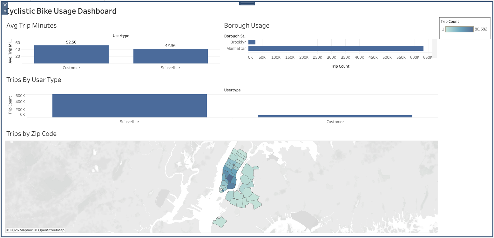

# Cyclistic BI Dashboard

Interactive BI dashboard analyzing Cyclistic bike usage using SQL, BigQuery, and Tableau.

## Dashboard Preview

## Tools Used
- SQL
- Google BigQuery
- Tableau Public

## Key Metrics
- Trip Count
- Average Trip Minutes
- Borough Usage
- Trips by Zip Code
- Trips by User Type

## Key Insights
- Subscribers generated significantly more trips than customers.
- Manhattan showed the highest bike usage.
- Trip duration differed between user types.
- Geographic patterns highlighted high-demand zip codes.

## SQL Query
See `cyclistic_query.sql`
